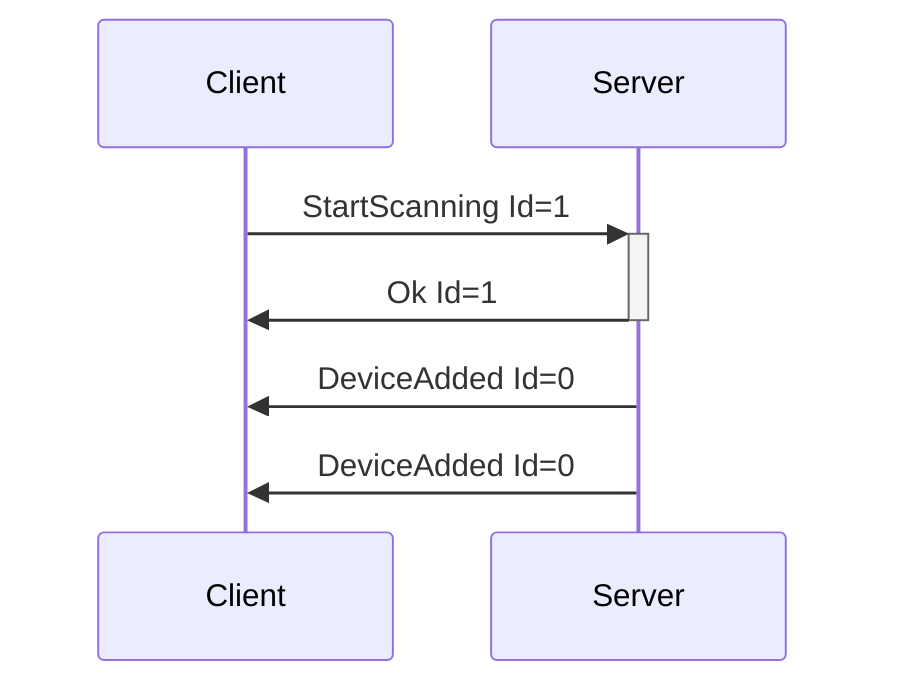
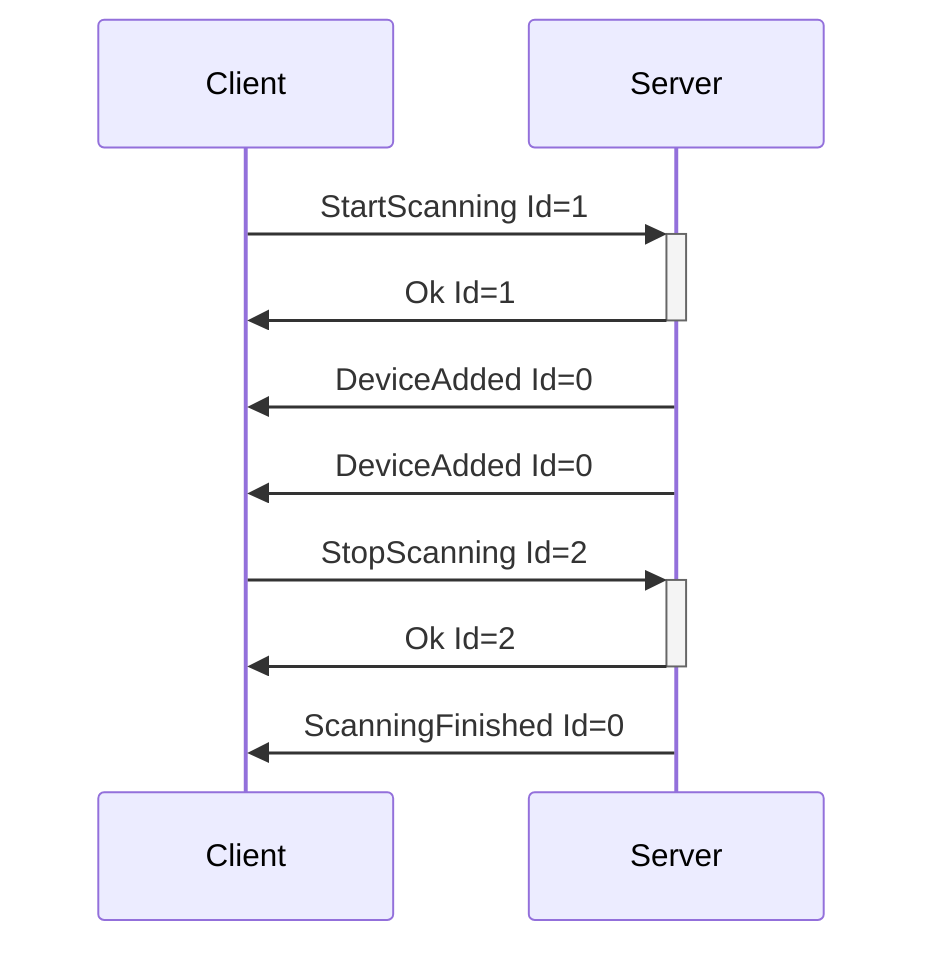
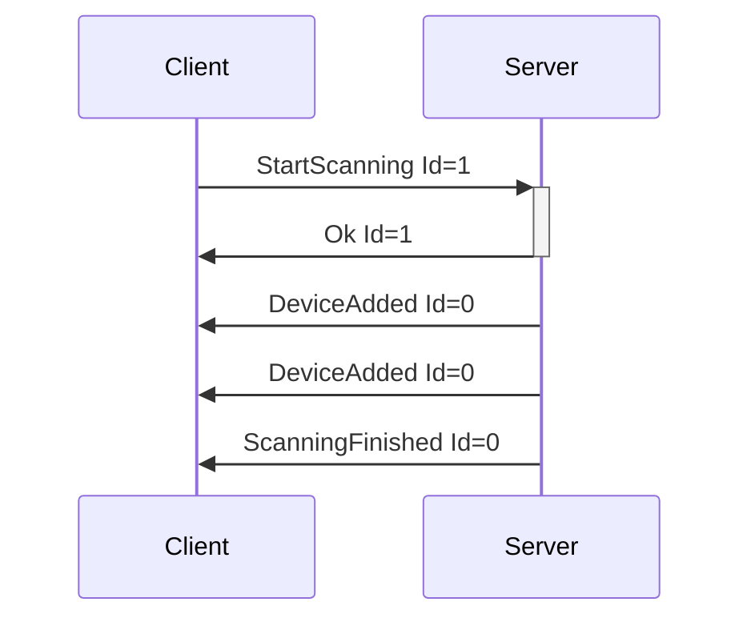
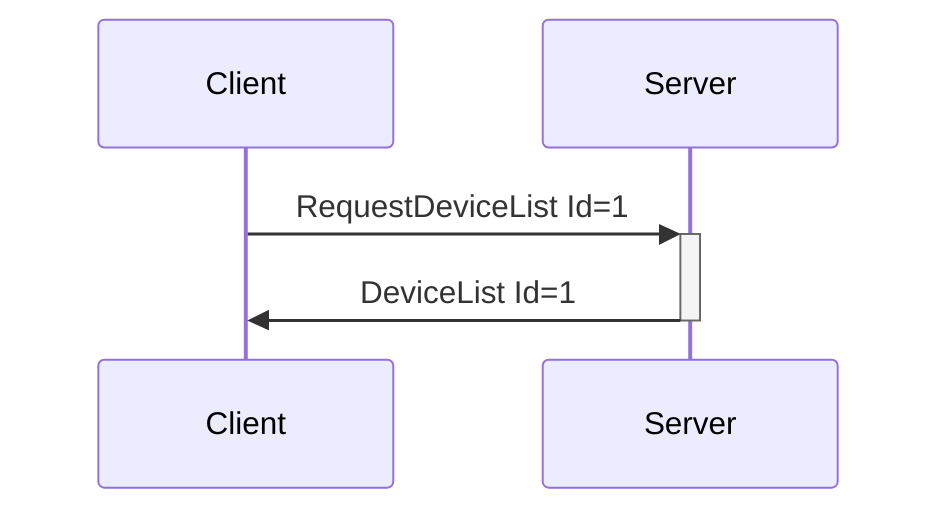
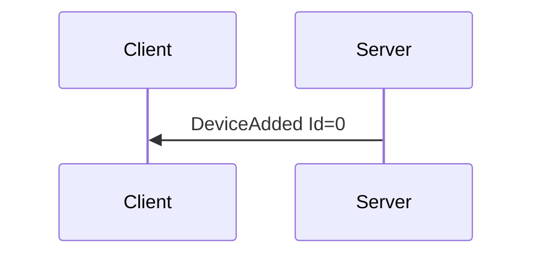
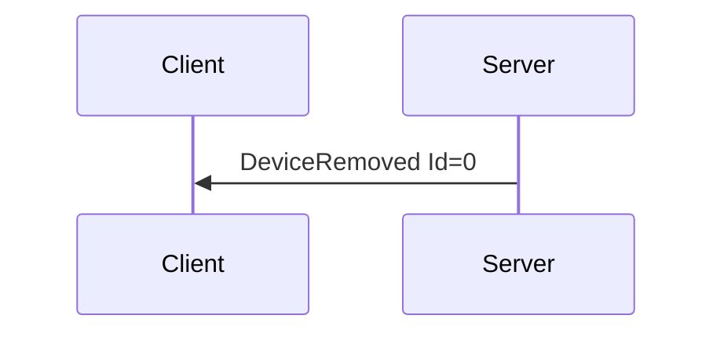

# Enumeration Messages

Messages relating to finding and getting information about devices connected to the system.

---
## StartScanning

**Description:** Client request to have the server start scanning for devices on all busses that it
knows about. Useful for protocols like Bluetooth, which require an explicit discovery phase.

**Introduced In Spec Version:** 0

**Last Updated In Spec Version:** 0

**Fields:**

* _Id_ (unsigned int): Message Id

**Expected Response:**

* Ok message with matching Id on successful request.
* Error message on value or message error.

**Flow Diagram:**



**Serialization Example:**

```json
[
  {
    "StartScanning": {
      "Id": 1
    }
  }
]
```
---
## StopScanning

**Description:** Client request to have the server stop scanning for devices. Useful for protocols
like Bluetooth, which may not timeout otherwise.

**Introduced In Spec Version:** 0

**Last Updated In Spec Version:** 0

**Fields:**

* _Id_ (unsigned int): Message Id

**Expected Response:**

* Ok message with matching Id on successful request.
* Error message on value or message error.

**Flow Diagram:**



**Serialization Example:**

```json
[
  {
    "StopScanning": {
      "Id": 1
    }
  }
]
```
---
## ScanningFinished

**Description:** Sent by the server once it has stopped scanning on all busses. Since systems may
have timeouts that are not controlled by the server, this is a separate message from the
StopScanning flow. ScanningFinished can happen without a StopScanning call.

In reality, this event is usually only useful when working with systems that can only scan for a single device at a time, like WebBluetooth. When on normal desktop/mobile APIs, it should be assumed that running StartScanning/StopScanning will be the main usage.

**Introduced In Spec Version:** 0

**Last Updated In Spec Version:** 0

**Fields:**

* _Id_ (unsigned int): Message Id

**Expected Response:**

None. Server-to-Client only.

**Flow Diagram:**



**Serialization Example:**

```json
[
  {
    "ScanningFinished": {
      "Id": 0
    }
  }
]
```
---
## RequestDeviceList

**Description:** Client request to have the server send over its known device list, without starting
a full scan.

**Introduced In Spec Version:** 0

**Last Updated In Spec Version:** 0

**Fields:**

* _Id_ (unsigned int): Message Id

**Expected Response:**

* DeviceList message with matching Id on successful request.
* Error message on value or message error.

**Flow Diagram:**



**Serialization Example:**

```json
[
  {
    "RequestDeviceList": {
      "Id": 1
    }
  }
]
```
---
## DeviceList

**Description:** Server reply to a client request for a device list.

**Introduced In Spec Version:** 0

**Last Updated In Spec Version:** 4 (See [Deprecated Messages](deprecated.md) for older versions.)

**Fields:**

* _Id_ (unsigned int): Message Id
* _Devices_ (array): Array of device objects
  * _Name_ (string): Descriptive name of the device, as taken from the base device
    configuration file.
  * _Index_ (unsigned integer): Index used to identify the device when sending Device
    Messages.
  * _MessageTimingGap_ (_optional_, unsigned integer): Recommended minimum gap between device
    commands, in milliseconds. This is only a recommendation, and will not be enforced on the
    server, as most times the server does not actually know the exact message gap timing required
    (hence this being recommended). Enforcement on the client (with developer option to disable) is
    encouraged. Optional field, not required to be included in message. Missing value should be
    assumed that server does not know recommended message gap.
  * _DisplayName_ (_optional_, string): User provided display name for a device. Useful for
    cases where a users may have multiple of the same device connected. Optional field, not required
    to be included in message. Missing value means that no device display name is set, and device
    name should be used.
  * _Actuators_ (array of [Actuator Attributes]): A list of actuators, including their descriptions
    and messages they can take. Each actuator represents a different output of the hardware it is describing (vibrators, stroking axes, etc...).
  * _Sensors_ (array of [Sensor Attributes]): A list of sensors, including their descriptions and
    messages they can take. Each sensor represents a different input of the hardware it is describing (battery level, pressure sensors, etc...).

**Expected Response:**

None. Server-to-Client message only.

**Flow Diagram:**


**Serialization Example:**

```json
[
  {
    "DeviceList": {
      "Id": 1,
      "Devices": [
        {
          "Name": "Test Vibrator",
          "Index": 0,
          "MessageTimingGap": 100,
          "DisplayName": "Rabbit Vibrator",
          "Actuators": [
            {
              "Index": 0,
              "Descriptor": "Clitoral Vibrator",
              "Messages": [
                {
                  "Type": "ScalarCmd",
                  "StepCount": 20,
                  "ActuatorType": "Vibrate"
                },
              ]
            },
            {
              "Index": 1,
              "Descriptor": "Insertable Vibrator",
              "Messages": [
                {
                  "Type": "ScalarCmd",
                  "StepCount": 20,
                  "ActuatorType": "Vibrate"
                }
              ]
            }
          ],
          "Sensors": [
            {
              "Index": 0,
              "FeatureDescriptor": "Battery",
              "Range": [0, 100],
              "Type": "Battery",
              "Readable": true,
              "Subscribable": false
            }
          ]
        },
        {
          "Name": "Test Stroker",
          "Index": 1,
          "MessageTimingGap": 100,
          "DisplayName": "User set name",
          "Actuators": [
            {
              "Index": 0,
              "FeatureDescriptor": "Stroker",
              "FeatureMessages": [
                {
                  "Type": "LinearCmd",
                  "StepCount": 100,
                },
                {
                  "Type": "ScalarCmd",
                  "ActuatorType": "Oscillate",
                  "StepCount": 10,
                },
              ]
            },
          ],
        },
        {
          "Name": "Test Kegel Pressure Sensor",
          "Index": 1,
          "DisplayName": "User set name",
          "Sensors": [
            {
              "Index": 0,
              "Descriptor": "Pressure Sensor (Calibrated)",
              "Range": [0, 1000],
              "Type": "Pressure",
              "Readable": false,
              "Subscribable": true
            },
            {
              "Index": 1,
              "Descriptor": "Pressure Sensor (Raw)",
              "Range": [0, 1000],
              "Type": "Pressure",
              "Readable": false,
              "Subscribable": true
            },
          ],
        }
      ]
    }
  }
]
```

---
## DeviceAdded

**Description:** Sent by the server whenever a device is added to the system. Can happen at any time
after identification stage (i.e. after client is connected), as it is assumed many server
implementations will support devices with hotplugging capabilities that do not require specific
scanning/discovery sessions.

**Introduced In Spec Version:** 0

**Last Updated In Spec Version**: 4 (See [Deprecated Messages](deprecated.md) for older versions.)

**Fields:**

* _Id_ (unsigned int): Message Id
* _Name_ (string): Descriptive name of the device, as taken from the base device
  configuration file.
* _Index_ (unsigned integer): Index used to identify the device when sending Device Messages.
* _MessageTimingGap_ (_optional_, unsigned integer): Recommended minimum gap between device
  commands, in milliseconds. This is only a recommendation, and will not be enforced on the
  server, as most times the server does not actually know the exact message gap timing required
  (hence this being recommended). Enforcement on the client (with developer option to disable) is
  encouraged. Optional field, not required to be included in message. Missing value should be assumed that server does not know recommended message gap.
* _DisplayName_ (_optional_, string): User provided display name for a device. Useful for
  cases where a users may have multiple of the same device connected. Optional field, not required
  to be included in message. Missing value means that no device display name is set, and device
  name should be used.
* _Actuators_ (array of [Actuator Attributes]): A list of actuators, including their descriptions
  and messages they can take. Each actuator represents a different output of the hardware it is
  describing (vibrators, stroking axes, etc...).
* _Sensors_ (array of [Sensor Attributes]): A list of sensors, including their descriptions and
  messages they can take. Each sensor represents a different input of the hardware it is describing
  (battery level, pressure sensors, etc...). 

**Expected Response:**

None. Server-to-Client message only.

**Flow Diagram:**



**Serialization Example:**

```json
[
  {
    "DeviceAdded": {
      "Id": 0,
      "Name": "Test Vibrator",
      "Index": 0,
      "MessageTimingGap": 100,
      "DisplayName": "Rabbit Vibrator",
      "Actuators": [
        {
          "Index": 0,
          "Descriptor": "Clitoral Vibrator",
          "Messages": [
            {
              "Type": "ScalarCmd",
              "StepCount": 20,
              "ActuatorType": "Vibrate"
            },
          ]
        },
        {
          "Index": 1,
          "Descriptor": "Insertable Vibrator",
          "Messages": [
            {
              "Type": "ScalarCmd",
              "StepCount": 20,
              "ActuatorType": "Vibrate"
            }
          ]
        }
      ],
    }
  }
]
```

---
## Message Attributes for DeviceList and DeviceAdded

**Description:** A collection of message attributes. This object is always an array element of a
Device Message key/value pair within a [DeviceList](enumeration.md#devicelist) or
[DeviceAdded](enumeration.md#deviceadded) message. Not all attributes are relevant for all Device
Messages on all Devices; in these cases the attributes will not be included.

**Introduced In Spec Version:** 1

**Last Updated In Spec Version**: 4 (See [Deprecated Messages](deprecated.md) for older versions.)

**Attributes:**

* _Descriptor_
  * Valid for Messages: ScalarCmd, RotateCmd, LinearCmd, SensorReadCmd
  * Type: String
  * Description: Text descriptor for a feature.
* _StepCount_ 
  * Valid for Messages: ScalarCmd, RotateCmd, LinearCmd
  * Type: unsigned int
  * Description: For each feature, lists the number of discrete steps the feature can use. This
    value can be used in calculating the 0.0-1.0 range required for ScalarCmd and other messages.
* _ActuatorType_
  * Valid for Messages: ScalarCmd, RotateCmd, LinearCmd
  * Type: String
  * Description: Type of actuator this feature represents.
* _SensorType_
  * Valid for Messages: SensorReadCmd, SensorSubscribeCmd
  * Type: String
  * Description: Sensor types that can be read by Sensor.
* _SensorRange_
  * Valid for Messages: SensorReadCmd, SensorSubscribeCmd (but applies to values returned by SensorReading)
  * Type: array of arrays of 2 integers
  * Description: Range of values a sensor can return. As sensors can possibly return multiple values
    in the same SensorReading message (i.e. an 3-axis accelerometer may return all 3 axes in one read), this is sent as an array of ranges. The length of this array will always match the number of readings that will be returned from a sensor, and can be used to find the reading count for a sensor.
* _Endpoints_
  * Valid for Messages: RawReadCmd, RawWriteCmd, RawSubscribeCmd
  * Type: array of strings
  * Description: Endpoints that can be used by Raw commands.

---
## DeviceRemoved

**Description:** Sent by the server whenever a device is removed from the system. Can happen at any
time after identification.

**Introduced In Spec Version:** 0

**Last Updated In Spec Version:** 0

**Fields:**

* _Id_ (unsigned int): Message Id
* _DeviceIndex_ (unsigned integer): Index used to identify the device when sending Device Messages.

**Expected Response:**

None. Server-to-Client message only.

**Flow Diagram:**



**Serialization Example:**

```json
[
  {
    "DeviceRemoved": {
      "Id": 0,
      "DeviceIndex": 0
    }
  }
]
```
